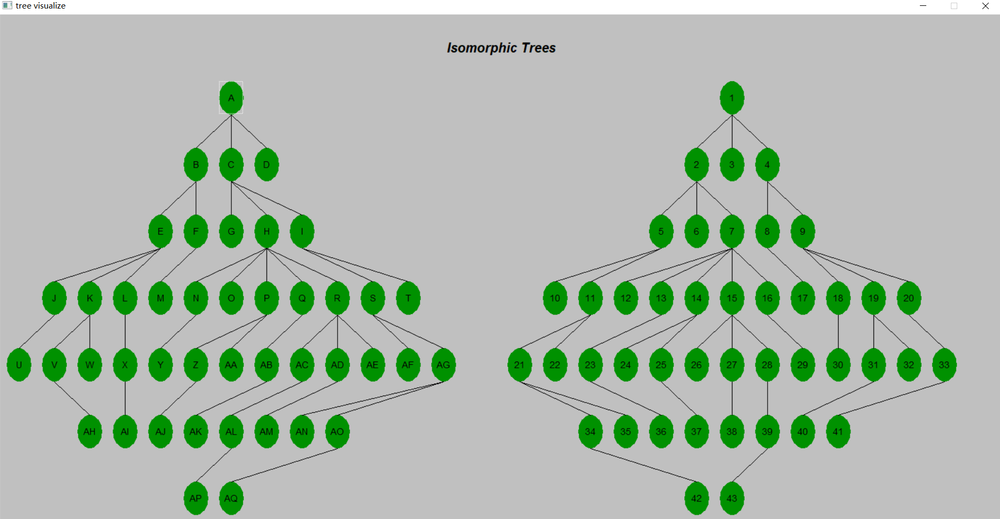
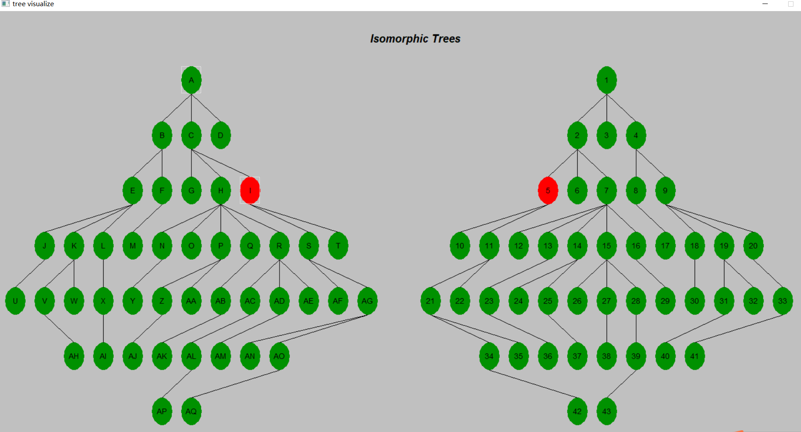
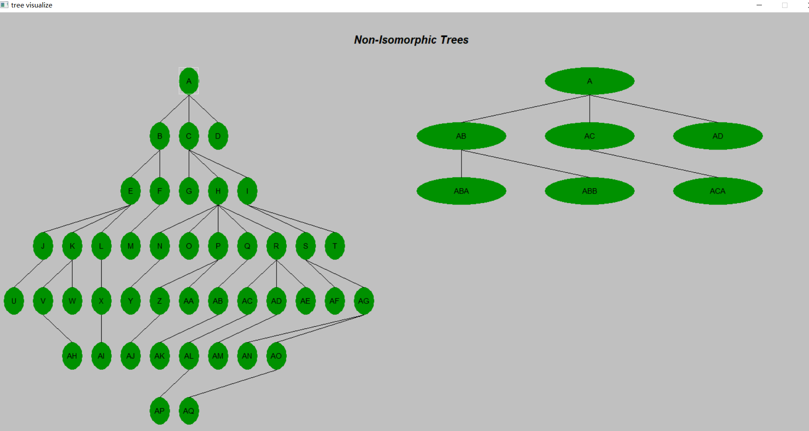

# 树的同构及可视化
## 任务描述
输入两个文件，每个文件包含一棵树（数据结构），将其可视化，判断这两棵树是否同构，并能够标记出匹配的点。

## 相关知识
文件读取 树（数据结构） 树同构的定义 树同构的判定方法 FLTK可视化实现

## 编程要求
（1）输入
输入为两个文件，分别定义了一棵有向树。每个文件中有n行，代表了该树的n条边。每一行的形式为“A->B”，即节点A为节点B的父节点。

（2）在文件中寻找输入树的根节点，并判断输入树的合法性和同构性

（3）可视化 
    1. 若输入的树合法，将两棵树用FLTK进行可视化。
    2. 若两棵树同构，当点击一颗树上的一个节点时，高亮该节点与另一颗树上相匹配的节点。如果存在多个可匹配的情形，则显示一个即可（即完成一一匹配）。

注意：

在判断树的同构时，忽略节点内容。
为了保证文件和树的一致性，树的子节点左右关系和文件中行的上下关系对应，例如，文件中出现A->B、A->C，代表画图的时候，A是父结点，B在C的左边
可视化形式见图片示例附件“大作业示例.png”。
如果不能通过点击结点实现高亮显示，则提供两个输入文本框，输入一棵树的结点，高亮显示两棵树之间的匹配节点。我们将酌情给分。
我们将提供的树节点数不超过150个，层数不超过7层。超出此范围的树的可视化将不计分。
## 给分点：

文件读取与解析 10’

树的可视化 10’

判断同构性 10’

找出匹配的点并可视化 10’

## 运行
```bash
sh comp.sh
./main <file1> <file2>
```
## 结果
```bash
./main 1-1.txt 1-2.txt
```


```bash
./main 1-1.txt 2-1.txt
```
